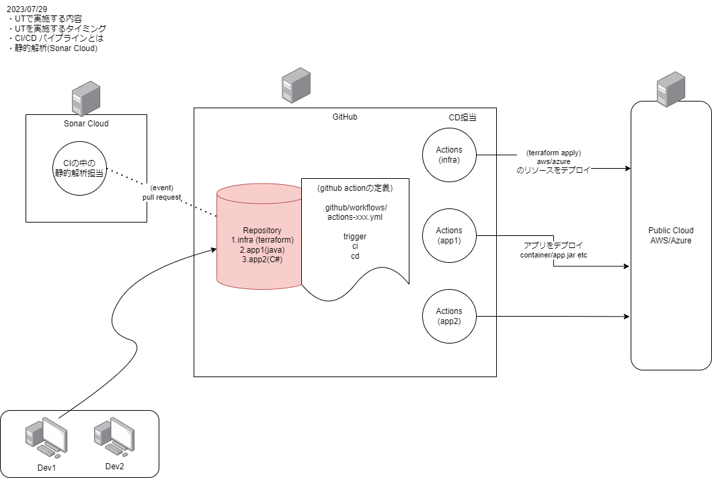

# Study CICD 2023

一般的なCI/CDの構成の話など

## 構成



## GitHub Actions

## Terraform

## Sonar Cloud

### テスト網羅率について(基礎)

C0: 命令　カバレッジ（ステートメント・カバレッジ）
```
すべての命令が実行されたかどうか
```

C1: 分岐　カバレッジ（デシジョンカバレッジ）
```
すべての分岐が実行されたかどうか
if(a and b)
```

C2: 条件　カバレッジ（コンディションカバレッジ）
```
すべての条件が実行されたかどうか
if(a and b)
```
※ANDやORで複数の条件が結ばれていても、それぞれを独立した条件として扱うため、C2はC1のサブセットとなる。

sonarcloudでcoverageを取得するには、別途設定が必要。CI(Github Action)に組み込む必要がある
```
coverage-example-vue2
```