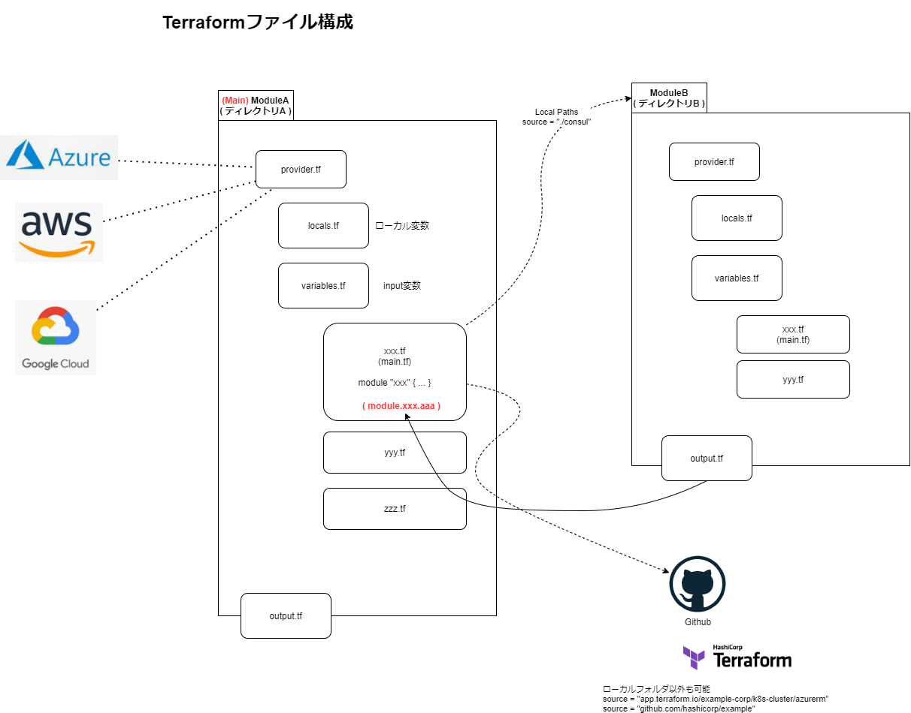

# Terraform の基本

ファイル構成を簡単に纏めておく

---

ファイル名はすべて任意だが、以下のような構成になっていることが多い

## provider.tf
プロバイダーを定義(azure, aws, gcpなど)
## locals.tf
モジュール内でローカル変数として扱える locals
## variables.tf
モジュールの入力として利用できる`input`を定義
## xxx.tf (main.tf)
リソースのデプロイ
他のモジュールのデプロイ
## output.tf 
モジュールの出力として利用できる`output`を定義
